# The DrSG harness kit: a short guide

> Three questions only: how it works, how to install it, how to package it for
> the next machine. Each script's own options are what its header comment and
> `--help` say; the memory layer is documented in full in `tools/README.md` at
> the root of the repository — it ships inside the bundle, so on an installed
> machine the same file is at `~/.drsg-memory/tools/README.md`.

---

## 1. How it works

### 1.1 Two planes, kept apart

| | Code graph (code plane) | Memory layer (memory plane) |
|---|---|---|
| Holds | symbols and edges the plugins parse out of source | `Project` / `Session` / `Fact` / `Event`, conventions of this layer |
| Written by | `drsg serve watch`, folding each commit incrementally | hooks (automatic) + the model, following an injected protocol |
| Granularity | **one per repository**: daemon, database, port, plane | **one shared** daemon and database, separated by `Project` |
| Database | `<repo>/graph.drsg` (a directory on the native backend) | `~/.drsg-memory/memory.drsg` |
| Answers | what is this symbol, who does changing it affect, how does A reach B | what was concluded before, what another agent left for me |

The native backend allows **one process per database**, so "put it all in one
process" is not a simplification — it welds two lifecycles together. The two
halves never share a database, a port or a token.



The two halves point **opposite ways**: the memory layer converges (one daemon,
one database, projects separated by `p.path`) while the code graph spreads out
(a port and a database per repository). Neither daemon starts at boot.

### 1.2 Where the code graph comes from

`serve watch` follows the repository's commits. On each one the language
plugins fold source into `Function` / `Method` / `Struct` / `Trait` / `Module` /
`File` nodes and `CALLS` / `REFERENCES` / `USES_TYPE` / `IMPORTS` edges, write
them into that repository's plane, and record the `synced_commit`. References
the parser cannot resolve stay as `UnresolvedRef` — **that is what keeps a
guess out of the resolved edges, and it is why the graph can be trusted when it
says "no"**.

The cost comes in two parts, and attributing them to the wrong thing is easy:
the plugins are wasm, and **the first load takes about 13.7 seconds regardless
of repository size** (measured 2026-08-20: six plugins, ~11.2 MB, and a
two-line Rust file costs the same); only the folding that follows scales with
the tree (~1.36 s in that run). So a normal start catches up incrementally, and
`--force` is for when the set of installed plugins changed.


One line on that diagram is worth remembering on its own: **the structural verbs
(`context` / `impact` / `trace` / `describe`) only query the plane, which is why
they work across repositories; `grep` and `snippet` read the file tree, and the
file tree is the one that process was started on (`--dir`), no matter which
`plane` you passed.** Asking another repository about structure is fine; asking
it for source means asking that repository's own daemon.

### 1.3 The verbs, and the two rules broken most often

| What you want | Verb | What you get |
|---|---|---|
| what a symbol is, who calls it | `context` | definition, signature, one-hop callers and callees |
| who a change to it reaches | `impact` | propagation along incoming edges, **grouped by distance with a count per group** |
| how A reaches B | `trace` | the path, hop by hop |
| signature and location | `describe` | a few hundred characters |
| the source text | `snippet` | the body |
| log strings, config, comments — text the graph does not model | `grep` | literal hits in the watched tree, each naming the symbol it sits in |
| what this plane holds, how far it is synced | `describe_plane` | a live catalogue (**never write the counts into a document — the next commit makes them wrong**) |

Two rules, both of them the residue of a real mistake:

1. **Deepen `impact` until a level comes back empty.** The default is 3 hops;
   truncating before propagation stops gives you "the first three hops", not
   the impact, and two symbols measured at different depths are not comparable.
   Measured: `Plugins::load` reports 12 at depth 3 and 15 at depth 5 with the
   fifth level empty — the missing 3 were never reached, not absent. The cap is
   6; if level 6 is still non-empty, report it the way the tool does, as a
   lower bound over recorded edges, not as closure.
2. **More than 20 candidates: do not pick from the list.** An ambiguous name
   returns the first 20 **in no particular order** — of the 99 candidates for
   `plugin`, the visible 20 held six CSS classes and an npm package, and the
   actual plugin loader never appeared. Narrow with `Type::method` instead.
   With 2–10 candidates, `describe` first: **a function returning another
   crate's type is a wrapper**, and running `impact` on a wrapper gives a
   strict subset of what the real one reaches.

And the backstop: **say so when the graph has nothing**. `.sh`, `.md`, CI
config, cross-language boundaries and uncommitted work are not in it. Use
`grep` there, and say that it is a lower bound over the spelling you happened
to think of.

### 1.3.1 Use case: locate a symbol and return its source

Suppose the request is: “Give me the implementation of `searches`.” Use the
calls in this order, passing the repository's actual plane every time:

```text
context("searches", plane="drsg-harness-kit")
grep(pattern="def searches", path="tools/codegraph-usage.py",
     context=2, plane="drsg-harness-kit")
snippet(name="tools/codegraph-usage.py:131-142", plane="drsg-harness-kit")
```

The three calls have different jobs:

| Call | Job | Result in this example |
| --- | --- | --- |
| `context` | Resolve a human-supplied name to a graph symbol | `codegraph-usage.searches`, a `Function` at `tools/codegraph-usage.py:131-142` |
| `grep` | Confirm the textual definition in the watched source tree | The `def searches(cmd):` hit at line 131 |
| `snippet` | Read the source for the confirmed range | The implementation and docstring from lines 131-142 |

`context` supplies identity and relationships, while `grep` confirms the text
and location. `snippet` is the call that actually returns the source body. The
“3 calls” count is an MCP-call count, not three source reads.

#### Without the code graph: the text-search path

If the symbol location is unknown, the non-graph path starts from the file
system:

```bash
rg -n --glob '*.py' '^def searches\(' .
sed -n '131,142p' tools/codegraph-usage.py
```

The flow is:

```text
directory → text match → file and line range → source text
```

Text search finds matching characters, not a resolved symbol. To find callers,
search again and manually discard definitions, comments, docstrings, strings,
and unrelated names:

```bash
rg -n '\bsearches\s*\(' tools
```

#### What the code graph adds

The code-graph path is:

```text
symbol name → canonical key → structural relationships and location → source text
```

For this example, `context` resolves `searches` to
`codegraph-usage.searches`, identifies it as a `Function`, and reports the
recorded caller `codegraph-usage.main`. `grep` confirms the source-tree text,
and `snippet` reads the implementation.

| Concern | Code graph | Text search only |
| --- | --- | --- |
| Input | Symbol name | Path, directory, or text pattern |
| Symbol identity | Canonical key and type | Text hit only |
| Callers and callees | Returned from recorded edges | Require another search and manual filtering |
| Change analysis | Continue with `impact` or `trace` | Manually follow references |
| Best use | Structure and relationships | Comments, config, logs, unsupported files, or an unavailable graph |
| Main limitation | Depends on plane freshness and parser coverage | Can over-match or miss references |

If the file and line range are already known, `sed` is shorter. The code graph
earns its extra calls when the request needs reliable symbol identity or
structural context, not merely a few lines of source.

### 1.4 The router: one entrance, many graphs

`codegraph-router.py` forwards MCP to MCP and reimplements no verb. On every
call it reads the registry (`~/.drsg-memory/graphs`, one repository path per
line, TAB plus a plane name when the plane is not the directory's own), resolves
the target, reads the address and token out of **that repository's own
`.mcp.json`** (a token is never copied to a second place), starts that
repository's daemon if it has to, and forwards. Nine tools: the local
`graph_repos` plus eight forwarded verbs.


What it removes is the model getting `plane` wrong: the default plane is an
empty one named `startup`, and an empty plane answers `no symbol matches` in
exactly the words a real miss uses. Through the router the plane comes from the
registry and cannot be typed wrong.

**Failure must not be forgeable**: a missing registry, an unreadable
`.mcp.json`, a daemon that will not start, an upstream error — each is reported
as an error. None of them may come back as an empty list wearing the face of
"the graph does not have it".

### 1.5 The memory layer: four node kinds, three edges, two read paths

```text
Project ←BELONGS_TO← Session      one per session
Project ←ABOUT←      Fact         reusable conclusions; without this edge a Fact is never read
Project ←NOTIFY←     Event        a to-do for another project; its own queue, no ranking
```

- **Address a `Project` by `p.path`**, never by key — a same-named node shadows it.
- **Read an Event's external key with `key(e)`.** `e.key` matches nothing, yet
  returns `props_set: 0` without an error: the to-do stays open while closing
  it looks like it worked.
- **Times are epoch integers.** An ISO string is accepted and then compares
  false against every integer already there, silently.

One session:

```text
SessionStart      record/restore the Session → build the standing briefing → list open Events (≤3) → inject the write-memory protocol
UserPromptSubmit  rank Facts by n-gram + IDF (≤4, may cross projects, labelled with their origin) → inject only on a hit → record telemetry
compact           SessionStart runs again and re-injects, without creating a second Session
SessionEnd        stamp ended_at, mine files / commands / tool outcomes from the transcript
Stop (optional)   the code-graph usage report; not installed by the memory installer, register it separately
```


Two of those lanes are worth reading on their own. **Telemetry**
(`recall.jsonl`) records a line whether recall hit or missed, and it is the only
basis anyone later has for judging whether recall was worth it.
**Cross-project** is the Event lane: it skips ranking entirely and goes to the
terminal (`systemMessage` reaches the human only — the model never sees it),
with `events_seen.json` making sure a to-do lights up once per session. A hook
that fails injects less; it never blocks the session.

Three ways in: L1 is what the hooks mine, L2 is **the Facts the model writes
itself** under the injected protocol (this is where the value is, and it is
only a prompt — nothing enforces it), L3 is transcript distillation (**off by
default**; what it wrote had no read path). Two ways out: the standing briefing
(per project) and per-prompt recall (across projects).

How the briefing is compressed (`all_facts` / `short_tag` / `build_briefing` /
`ensure_briefing` in `session_start.py`): take this project's Facts
(`ORDER BY created_at DESC LIMIT 1000`) → compress each to a ≤18-character tag
by rule (keep the conclusion side of an arrow, first sentence, truncate; no
model call) → group by `kind` into `• <kind> ×<n>: tag; tag; …` → store it in
`Project.briefing` and **rebuild only when the Fact count changes**.

So what is bounded is each Fact, not the total: **the briefing has no length
cap and grows linearly with the Fact count**, measured at about 21 characters
per Fact (one install's telemetry: 26 Facts = 536 characters, 114 = 2383, plus
a fixed ~820-character protocol). The only hard bound is the 3-Event block. Two
consequences: Facts have to be pruned by hand, and **editing a Fact's text
without changing the count leaves the briefing stale** (the cache is keyed on
the count).

---

## 2. Installing it

### 2.1 Prerequisites

- a working `drsg` binary (with `serve`, `/rpc`, `/mcp`);
- Python 3, `curl`, `openssl`;
- Claude Code, or another harness that can register MCP servers and hooks;
- a free loopback port, and a backup plan.

### 2.2 The memory layer (shared)

```bash
tools/install.sh <project-dir> --bin <path-to-drsg> --addr 127.0.0.1:7700
```

It ensures the shared daemon runs (starting it if not), copies the hooks into
`<project>/.claude/hooks/`, writes `<project>/.drsg/env` (`chmod 600`: address,
token, and the **name** of the L3 key variable), merges the three hooks into
`settings.local.json`, registers the `drsg` and `drsg-events` MCP servers, and
**self-checks** — daemon reachable, plane present, the `Project` resolvable by
path, a temporary Fact readable through the hooks' own recall query. Any failure
exits non-zero.



The dividing line is the pair of boxes above: **what stays inside a project is
`.drsg/env` (the token, `chmod 600`, gitignored), the hooks, and
`.drsg/recall.jsonl`** — one copy per project, all with the same contents. The
daemon and `memory.drsg` exist once per machine. So adding a project does not
add a daemon, and removing one takes nobody else's memory with it.

**Joining a daemon that is already running requires its token**, or the install
cannot reach the same database:

```bash
tools/install.sh <project-dir> --bin <path-to-drsg> \
  --addr 127.0.0.1:7700 --token "$DRSG_TOKEN"
```

Note that **hooks are overwritten, not merged**: a project with its own
SessionStart hook loses it, so back it up. Keep the daemon's home out of any
working tree. Leave L3 off unless you want it (`--l3-chat`, and pass only the
key's variable **name** via `--l3-key-env` — the value stays on the daemon).

### 2.3 The code graph (one per repository)

```bash
tools/codegraph.sh install --dir <repo-root> --port <port>
```

End to end: `drsg init` if the repository has never been digested, start
`serve watch`, write the sentinel rules block into that repository's CLAUDE.md,
register the SessionStart guard. Idempotent. Day to day:

```bash
tools/codegraph.sh status  --dir <repo-root>
tools/codegraph.sh doctor  --dir <repo-root>   # plane present, folded to HEAD, rules block current, guard registered
tools/codegraph.sh restart --dir <repo-root>   # incremental catch-up, about a second
tools/codegraph.sh restart --dir <repo-root> --force   # full rebuild, see below
```

**`--force` opens a window that answers wrongly** (millisecond log alignment,
2026-08-20): for ~13.4 s the old plane still answers, but about the old commit
— it does report its `synced_commit` — and then for ~1.36 s the plane has been
dropped and re-created but not yet filled. Use it when the plugin set changed,
and never point the code-graph scripts at the memory plane.

A repository that does not build `drsg` itself needs the binary named once;
it is remembered afterwards:

```bash
DRSG_CODE_BIN=<path-to-drsg> tools/codegraph.sh install --dir <repo-root> --port <port>
```

### 2.4 Install the router and usage report independently

The router and usage report are separate optional components. Installing the memory layer or a local code
graph does not install either one automatically.

For a hub project that needs cross-repository code-graph access, install only the router:

```bash
tools/codegraph-router-setup.sh <hub-project>
```

This registers the `codegraph` MCP server (the router) and verifies the registry. `codegraph.sh install`
appends repositories itself; edit the registry by hand only for a repository that never went through `install`,
or when the plane name differs from its directory name — append, **never `>`**:

```bash
printf '%s\n'     '<repo-a>'            >> ~/.drsg-memory/graphs
printf '%s\t%s\n' '<repo-b>' '<plane-b>' >> ~/.drsg-memory/graphs   # a real TAB
```

For usage reporting in any project that uses code-graph tools, install the report independently:

```bash
tools/codegraph-usage-setup.sh <project-dir>
```

This registers only the `Stop` hook; it does not register the router or change MCP configuration. One report
counts both native `mcp__drsg*` / `drsg-watch` calls and routed cross-repository
`mcp__codegraph__graph_*` calls. Both paths use the same report, so a hub does not need the router in order to
report native usage. Call counts are exact; returned-token counts are estimates and are marked with `~`.

If both components are wanted, use the explicit compatibility convenience entry point:

```bash
tools/codegraph-hub-setup.sh <hub-project>
```

A custom registry must be included in the router's registration; exporting it once in a shell is not enough:

```bash
claude mcp add --scope local -e DRSG_GRAPHS=<registry-file> codegraph -- python3 <router-path>
```

### 2.5 Acceptance

**Restart the session** afterwards — hooks and MCP servers are read at startup —
then confirm each line:

```text
memory layer
[ ] /health answers, and so does /rpc with the Bearer token
[ ] the memory plane exists, and the Project resolves by p.path
[ ] SessionStart injects a briefing (or an explicit empty result)
[ ] UserPromptSubmit records its decisions (<project>/.drsg/recall.jsonl)
[ ] SessionEnd writes ended_at
[ ] event_post / event_list / event_done all verified
[ ] no LLM key value in the project config, shell history or documents
[ ] exactly one process has the memory database open

code graph
[ ] the graph database is not the memory database
[ ] doctor passes: plane present, folded to HEAD, rules block names the right plane
[ ] graph_repos lists the repositories
[ ] stopping a repository's daemon makes the router error, not answer empty
[ ] snippet's source root matches the plane it was asked about
```

Two read-only checks are worth running regularly:
`tools/install.sh --check` (deployed hooks vs the templates they
came from; exits 1 on drift, so it works as a gate) and `analyze_recall.py`
(recall utilization and cost — **it carries a ~45% random floor**, so never read
the percentage bare).

---

## 3. Packaging and one-click install

### 3.1 Why a bundle

The copies that run have to live **outside the repository**. Every script here
is tracked by a branch, so checking out another branch deletes them from the
working tree — and the `drsg-events` MCP registration then points at a file that
does not exist. That is why `~/.drsg-memory/tools/` holds a runtime copy while
the repository holds the source. Packaging is what turns "the repository's copy"
into something another machine can unpack into that same runtime layout.

### 3.2 Build

```bash
./pack.sh               # writes dist/drsg-harness-kit-<version>.tar.gz and .sha256
./pack.sh --out /tmp/x --name my-kit
```

Layout (`tools/` is exactly what `~/.drsg-memory/tools/` has to hold):

```text
drsg-harness-kit-<version>/
  setup.sh          the installer (next section)
  install-drsg.sh   fetches a release binary when there is none
  tools/            the memory layer (with templates/hooks) + codegraph.sh
                    + codegraph-router.py + codegraph-usage.py
                    + codegraph-router-setup.sh + codegraph-usage-setup.sh
                    + codegraph-hub-setup.sh + drsg-usage-report + drsg_usage_report.py
  skills/           the codegraph skill, installed under ~/.claude/skills
  MANIFEST          source commit, build time, per-file sha256
```

`MANIFEST` is what tells a drifted deployment apart from one built at a
different commit.

### 3.3 Install on the new machine

```bash
tar xzf drsg-harness-kit-<version>.tar.gz && cd drsg-harness-kit-<version>
./setup.sh --project /path/to/project --repo /path/to/repo --bin /path/to/drsg
# optional, independently: --router /path/to/hub or --usage-report /path/to/project
```

Five required steps plus an optional hub phase, each idempotent, any failure stopping the rest:

1. lay `tools/` into `${DRSG_MEM_DIR:-~/.drsg-memory}/tools` and make it executable;
2. lay `skills/` into `~/.claude/skills` (`--no-skills` to skip);
3. locate drsg: `--bin` → `PATH` → download, but only with `--fetch-drsg`
   (reaching the network is not something to do on someone's behalf by default);
4. `--project`: run the memory-layer installer, self-checks included;
5. `--repo`: `codegraph.sh install --dir …` with the binary just located;
6. optional, only when explicitly requested: `--router DIR`, `--usage-report DIR`, or
   `--hub DIR` for both. No option is inferred from `--project` or `--repo`.

Also: `--addr` / `--token` (required to join an existing daemon), `--port` (that
repository's code-graph port), `--tools-dir` (move the runtime copies).
**Restart the session** afterwards, then work through 2.5.

### 3.4 Upgrading

Edit the source in the repository, then rebuild with `pack.sh` and re-run
`setup.sh` — the same path on this machine and any other. `setup.sh` is
idempotent: it overwrites the runtime copies and re-runs the installers'
self-checks. It does not touch a database and does not restart a running
daemon; that is an explicit act, and one to take only after confirming no write
is in flight.

---

## 4. Things not to do

- **No token in version control.** `.drsg/` goes in `.gitignore`; an LLM key
  travels as a variable name, never a value.
- **One process per database.** The hooks speak RPC; do not also open the
  database with a CLI that opens it directly.
- **A Fact with no `ABOUT` edge does not exist.** `Project` by `p.path`, an
  Event's key by `key(e)`, times as epoch integers.
- **A to-do is an Event, not a Fact.** Facts arrive by ranking, and a to-do that
  loses a ranking contest is never delivered at all.
- **Before `--force`**, confirm the plane name, the database directory and the
  backup — and never point these scripts at the memory plane.
- **A quantified claim comes from the graph.** The moment an answer says "only
  X call sites" or "nothing else is affected", it is a structural claim:
  `context` cannot answer it, `impact` can, and the grouped counts plus the
  tool's own lower-bound note belong in the answer.
